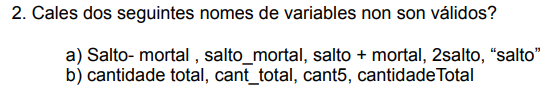

# Ejercicio 2 Boletin 1

a)
Salto- mortal : invalido por espacios
salto_mortal : valido
salto + mortal: invalido por signo +
2salto: invalido por empezar por numero
"salto" : invalido por comillas

b)
cantidad total: invalido por espacio
cant_total, cant5 y cantidadeTotal : validos